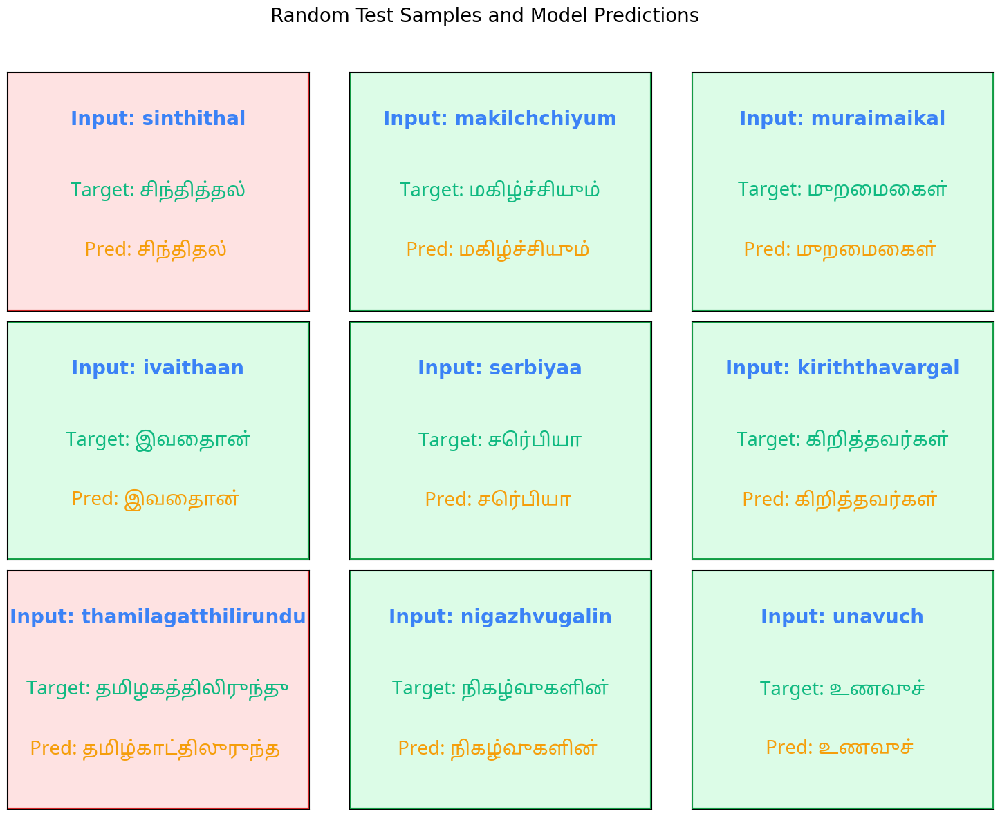
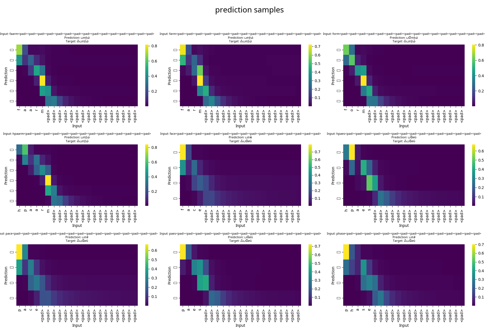

# DA6401_Assignment3
The repository contains solutions to the Assignment 3.

## Wandb report link:
https://wandb.ai/navaneeth001/Assignment3/reports/DA24S009-Assignment-3--VmlldzoxMjc3MjI5NA

# Sequence-to-Sequence Model with Attention in PyTorch

There are two main ipynb files in this repository.
1. Assignment3.ipynb:
- This file contains codes and solutions for question 1 to 4
- I have defined a Sequence to Sequence model which contains 
    - input layer for character level embedding
    - one encoder RNN which encodes Latin character sequences
    - one decoder RNN which outputs Devanagari character sequences
- The first cell cell contains necessary code for dataset preprocessing, it must be run first for using the dataset for ruther processing
- The second code cell contains answer for question 1, where the basic architecture of the seq2seq is defined as functions. Note: This is just a basic function definition just to anser the question. 
- The third code cell actually contains the code for training the seq2seq model using wandb sweep config
- the fourth code cell contains the code for testing. The testing code will actually download the best model from the wandb artifacts and use it for testing. 
- The fifth code cell contains the code to visualize the sample predictions done by the model on test dataset. 
You will need to download the font from https://fonts.google.com/noto/specimen/Noto+Sans+Tamil as matplotlib does not support tamil font by default. 
download this and paste the link in 

```python
tamil_font_path = "/mnt/e_disk/DA6401_Assignment3/NotoSansTamil-VariableFont_wdth,wght.ttf"  
```

Note: you may comment the below (from START to END) lines and directly copy paste the path of the model, which will be in artifacts folder of this repo as the file may be inaccessible for downloading from external accounts.

```python
# === START ===
ENTITY     = 'navaneeth001'
PROJECT    = 'Assignment3'
SWEEP_ID   = 'd7qd4jns'  # ❗ Replace this with actual sweep ID
ARTIFACT_REF = 'navaneeth001/Assignment3/best-model:v151'
OUTPUT_DIR = '/mnt/e_disk/DA6401_Assignment3/predictions_vannila'
CSV_PATH   = os.path.join(OUTPUT_DIR, 'test_predictions.csv')

api      = Api()
sweep    = api.sweep(f"{ENTITY}/{PROJECT}/{SWEEP_ID}")
runs     = sweep.runs
best_run = min(runs, key=lambda r: r.summary.get('val_loss', float('inf')))
cfg      = best_run.config

eval_run = wandb.init(
    project=PROJECT,
    entity=ENTITY,
    job_type='evaluation'
)
artifact     = eval_run.use_artifact(ARTIFACT_REF, type='model')
download_dir = artifact.download()

# === END ===
```
Before testing, you also change the colors in the code cell for preferable visualisation
Test Samples:


2. attentionSeq2Seq.ipynb:
- This file contains solutions for question 5 to 7
- I have trained an attention based model for performing the same transliteration task
- output attention heatmap:


## Loading the dataset:

- Download the Dakshina dataset from https://github.com/google-research-datasets/dakshina

- The dataset should be download and placed in the following order:
"dataset/dakshina_dataset_v1.0/ta"

- you may replace ta with any other language like hi, ur, etc. available in the dataset


## Features

- Customizable encoder-decoder architecture using LSTM or GRU cells
- Attention mechanism for improved sequence alignment and interpretability
- Configurable training via Weights & Biases sweeps
- Real-time logging of loss, accuracy, and model checkpoints
- Attention heatmap visualization for interpretability

## Requirements

- Python >= 3.7
- PyTorch >= 1.10
- wandb
- matplotlib
- seaborn
- tqdm

Install dependencies via:

```bash
pip install -r requirements.txt


